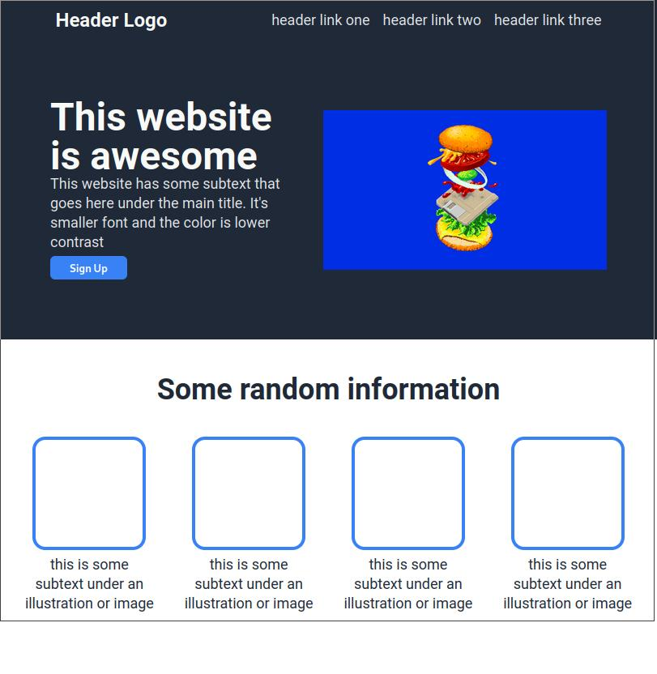

This is my second project while doing the odin project! I tried using pug and sass on this one since I was already familiar with those languages and felt like it was a good chance to apply them. The site has no mobile mode since it was not meant to be made mobile-first in this odin lesson.

## Table of contents

- [Overview](#overview)
  - [Screenshot](#screenshot)
  - [Links](#links)
- [My process](#my-process)
  - [Built with](#built-with)

## Overview

### Screenshot

### Links

- The Odin Project Lesson: [https://www.theodinproject.com/lessons/foundations-landing-page](https://www.theodinproject.com/lessons/foundations-landing-page)
- Live Site URL: [https://andrefhcaldeira.github.io/odin-lp/dist/](https://andrefhcaldeira.github.io/odin-lp/dist/)

## My process

### Built with

- Semantic HTML5 markup
- Pug
- Sass
